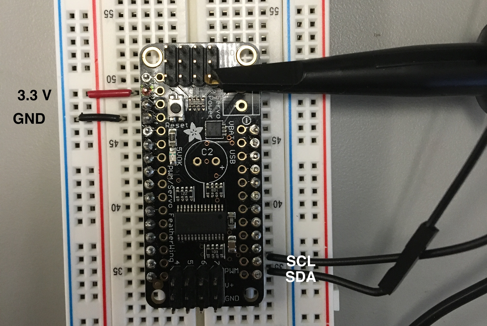

# How to use PWM Module

How to use the 8-Channel PWM featherwing module PCA9685: A short guide.

The schematic/pinout is the lower right of the file `PCA9685_pinout.png`, which should be in the same directory as this. If not, it can be found [here](https://learn.adafruit.com/16-channel-pwm-servo-driver/downloads), along with all the other possibly relevant files.

## Some Nice Links

* [Here is technical info on i2c, good to know](https://i2c.info)
* [Here is the datasheet on the PCA9685, has some nice PWM stuff](https://github.com/kotachang/UBCSubbots/blob/master/PWM/PCA9685.pdf)
* [What is PWM?](https://en.wikipedia.org/wiki/Pulse-width_modulation)

## PCA9685 Setup

Please checkout the file `PCA9685_pinout.png` for a full pinout. But if you don't, here is the important bits.



Note that if you reverse bias power and ground, you will make the IC very hot; however, it seems like it doesn't break if you catch it fast enough. If you reverse bias SCL and SDA, its no big deal, but i2c wont work. Best not to do it.

## Why Raspberry Pi

I was trying to figure out how the PCA9685 works, so the ease of the Raspberry Pi lends itself well. I would like to figure out the acutal i2c commands that control the PCA9685; however, we are going to be using a ROS library to control the PWM module, so that is unecessary.

Regardless, if you are using an arduino, for example, there are plenty of tutorials out there for that. Google-fu is your friend, and an incredibly important skill. This README is really more for getting the PWM module working and verifying how to use it.

## Raspberry Pi Setup

The Raspberry Pi is great for quick prototyping, and that is what I used to figure out basic operation of the PCA9685. [Here](https://pinout.xyz/pinout/i2c) is another good resource. To get that going, you have to do a couple steps:

1. Confirm that you have the line `dtparam=i2c_arm=on` in the file `/boot/config/txt` on your Pi so i2c is enabled. Reboot if you had to change anything.

2. Run the command `sudo apt-get install -y i2c-tools` to get i2c tools for your Pi.

3. Run the command `sudo i2cdetect -y 1`, and go to [here](https://man.cx/i2cdetect) to decypher what that gives you. If you have your Pi properly connected to your PCA9685, you should get `40` and `70` under the zero column.

## Running the PWM board with Python

From [here](https://learn.adafruit.com/16-channel-pwm-servo-driver?view=all), this gives a tutorial on getting the PWM module working on a Pi. Python3 is required. This will be good for playing with the PWM module, testing, etc.

1. Run the following commands to install the necessary libraries on your Pi:

```sh
sudo pip3 install adafruit-circuitpython-pca9685
sudo pip3 install adafruit-circuitpython-servokit
```

2. Copy and create this new file. Run with python3 (e.g. `python3 filename.py`):

```python
from board import SCL, SDA
import busio
import time

# Import the PCA9685 module.
from adafruit_pca9685 import PCA9685

# Create the I2C bus interface.
i2c_bus = busio.I2C(SCL, SDA)

# Create a simple PCA9685 class instance.
pca = PCA9685(i2c_bus)

# Set the PWM frequency to 50hz.
pca.frequency = 50

# Set the duty cycle to 1.5 ms (or 0x1333 in this case)
pca.channels[0].duty_cycle = 0x1333

# Wait for initialization from the motor (motor should have a low and then a high beep)
time.sleep(3)

# Motor is initialized, so change duty cycle to control the motor
pca.channels[0].duty_cycle = 0x1729
```

3. Play with  `pca.channels[n].duty_cycle` to change the duty cycle of channel n.

## Motor Initialization

Motor initialization is required before using the motors. When you turn on the motors, it should play three raising tones. Initialization occurs when you run the following code:

```python
pca.frequency = 50

# Set the duty cycle to 1.5 ms (or 0x1333 in this case)
pca.channels[0].duty_cycle = 0x1333

# Wait for initialization from the motor (motor should have a low and then a high beep)
time.sleep(3)
```

PWM frequency is 50 Hz. A duty cycle of `0x1333` is a 1.5 ms duty cycle. 

### TODO

1. Get it working with ROS

2. Write the controller for the PWM modules (maybe software team does this, but I wouldn't mind if they are busy)
