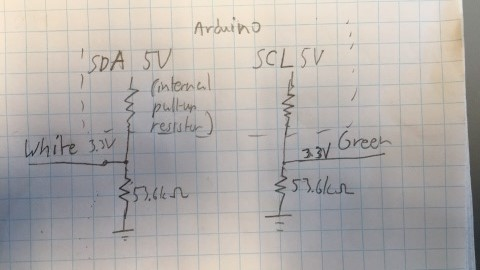
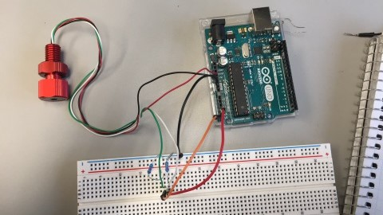

# How to Connect Pressure Sensor to Arduino

Connect Red wire to 3.3V, Black Wire to GND

White and Green wires have to be connected to Arduino via a voltage divider (connecting directly to Arduino will 
fry the pressure sensor. 3.3V devices can't take more than 3.3V)

White connects to SDA (A4 on UNO, 20 on MEGA)
Green connects to SCL (A5 on UNO, 19 on MEGA) 

Also connect the second GND pin on the Arduino to the ground of the voltage divider 

Pressure Sensor code is located within this repo (within pressure_sensor_ex folder)
