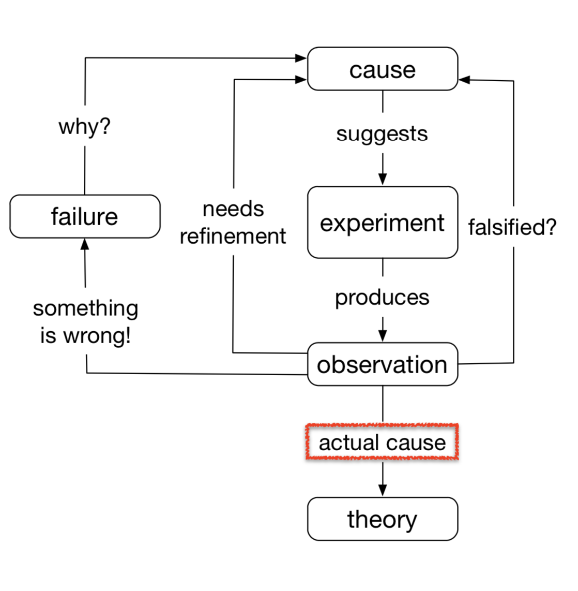

# Debugging

## Building a circuit that's easy to debug

### 1 Modularity

This is a key concept. Computer scientists stole this from electrical engineers in the 70s because they recognized the value of this principle. The main idea is to chain small circuit components that do one thing at a time. Consider the following active low-pass filter:

This circuit acts as a low pass filter, but also provides a gain of 10 to the input.

If the amplitude, at say 10kHz, is lower than expected, it's not immediately obvious if the issue is

a) The gain being too low, or

b) The cut off frequency being too low

The ambiguity makes it hard to reason out what the issue is, and adds an extra step to debugging the circuit. Had the circuit been a low pass of gain ~1 connected to a amplifier of gain 10, one could check the two circuits individually, and the debugging process would have been much more simple.

This particular example was chosen because there is a way out. One can simply set the input to a DC voltage in order to check the gain independently of the transfer function. This is important, as there is a trade off to splitting the circuit into too many components. An easy testing procedure (such as feeding a DC voltage to check the gain of the circuit above) makes it okay to combine components. One can easily imagine a circuit where it is much harder to check, and should be split up.

The key message is this: in general, don't make components/small circuits do too many things. It's easier to debug separate small circuits that chain together.

As a quick exercise, try to imagine how you would debug an active band-pass filter with gain 10 that's providing an amplitude ~5% lower than expected. It's hard to use a DMM to measure capacitance and inductance exactly, so you only know the peak frequency within 5%. Assume everything is soldered.

### 2 Inputs/Outputs to a component
A good component has clearly defined outputs for a given input. This property makes it easy to use an oscilloscope to check whether or not this particular component is causing issues. A component that has an inner state (output depends on both input, and past inputs), or depends on many inputs, becomes very hard to check, as the bug may only arise in one particular situation. Reproducing the exact state which caused the bug is necessary, and may be tedious.

### 3 Considerations with ICs

- Many ICs are sensitive to static electricity. One can get rid of much headache by ensuring that they discharge static electricity before handling ICs. It's customary to look over at the person next to you, declare "ground yourself!", and then smack a piece of metal such as a table leg to do this. Some say you can skip the first two steps, but I'm not sure.
- Many ICs have multiple components loaded onto a single chip. It's rare to see an IC with only one `and` gate or comparator on it. Using the same chip for multiple purposes can make it hard to tell exactly what is going on, or make it hard to probe.
- It is tempting to use one IC per circuit component, and give circuits large physical separation to make it easier to probe. However, making small circuits is required for easy mechanical integration of circuits. There is often a trade off between making the circuit easier to debug, and the physical size of a circuit. Deciding exactly how to plan a circuit in consideration of this takes experience and communication with the mechanical team.

## How to find a bug

A typical system will be comprised of large modules connected together. Each modules will be built of smaller modules, until there are only irreducible components.

The algorithm for finding a bug in a typical circuit goes:

1) Look at one of the largest modules, preferably the one that you suspect is causing issues, and check the output for a few inputs. The best way to do this is with an oscilloscope. Ideally you can check the input that breaks the circuit, but this may not always be known. If the input works, move to the next large module.

2) When you find a module that is having unexpected behaviour, zoom in and check a smaller inner modules.
3) Eventually you'll just have a circuit of a few irreducible components chained together. Check the output of the first component, if it as expected, move to the next component, until you find the exact component that breaks. Hypothetically you could use a binary search to speed up the process, but it is often nice to go about it one by one systematically to be sure.

It's normal to find bugs when prototyping a smaller component. In this case you can just start at step 3 if it is convenient. Alternatively, one may be confident that the bug is in a certain small module. In this case, one can also skip directly to step 3.

## Fixing a bug

### The Process

To figure out exactly what the bug is takes experience and perseverance.

There are three steps to fixing a bug

1) Come up with a hypothesis about the likely cause for the bug. What is causing the incorrect behaviour?
2) Test whether or not the explanation is correct. Return to step 1 if not.
3) Think of, and implement a solution

A good debugging process draws from the scientific method.

### Picking the hypothesis

When considering which hypothesis to test, there are two things to consider

a) How likely it is that the reason is correct.

b) How easy it is to check the reasoning.

The behaviour of a certain bug may point towards a certain explanation for the error, but it may be worth exploring alternative reasons if the explanation is difficult to check.

Even if the behaviour of a given bug points all fingers to a giant sign saying "the reason is REASON_A", it would still be better to check REASON_B first if checking REASON_A would require reformulating quantum mechanics to do so. One can attempt REASON_A after quickly confirming that REASON_B does not explain the incorrect behaviour. In total, if it is easier to check less likely scenarios when the most likely scenario is really difficult to check, check the less likely scenarios first.

It is a bit of a judgement call as to when it is worth going through the effort to check a harder explanation to a bug first. There are no hard rules here.

In my personal experience the most likely causes of a given issue are: wires shorting, wires not making a proper contact, ICs getting fried by static electricity, and missing critical specification on the datasheet. Thankfully, all of these, bar the last reason, are fairly easy to test.

### The experiment

There are a number of properties that separate a good experiment from a bad one. A good experiment should:

1) Be driven by hypothesis. You don't need to formally write out the problem statement, and hypothesis (though on a sufficiently hard problem you probably should). However, there is a lot of time to be lost by attacking a bug by tinkering. Aside from issues of time efficiency, it is possible that by randomly tinkering with the circuit the incorrect behaviour is removed, but the underlying issue is not dealt with. Further modification down the circuit could easily cause the bug to rearise, possibly after it has been fully soldered in.

2) Change only one thing. As engineers we want to be deliberate. An experiment that changes many things might lead to an incorrect assumption about the underlying cause of the bug. Fully understanding the underlying issue is incredibly useful not just for implementing the solution, but also for being able to quickly recognize when the bug may appear later down the road.

As an aside, please remember to run one experiment at a time. It seems fairly obvious, but I've seen many frustrated people throw the kitchen sink at problems they have been debugging all day. It's very common to come out of an experiment with more problems than one had originally. Doing too many things at once can make this impossible to reverse. Be deliberate.

Common examples of an experiment are: checking the input to a component to see if the waveform is deformed, replacing an IC that is suspected to be broken, replacing a microcontroller that is suspected to be broken, and using a DMM to check if pins or wires are shorted.

Now after the experiment has been done, make observations and refine the hypothesis, or use the knowledge gained to implement the solution.

Ultimately, there is only one algorithm to solving a hard problem. It has nicely been described by Richard Feynman as:

1) write down the problem
2) think really hard
3) write down (and test!) the solution

## Conclusion

I've made debugging seem like a step by step structured process. In practice, many of the steps will overlap. Many bugs will be caught while prototyping the original small component rendering the second section useless. As for the third section, it may seem like people are not properly picking a hypothesis. With common bugs people can often recognize the underlying cause of a bug almost instantly after observing the behaviour. Furthermore, the experiment often implements the solution making it seem like one step. That quick process to debugging is still implementing the same approach we are taking, but is simply expedited due to experience. The structured process to lean is always useful when running into a novel problem.

**Appendix A:**
TODO: Some tools of the trade that are useful for debugging. Wireshark/serial port monitors, making LTSPice simulations to check if the issue is systemic to the design, or if it's an implementation issue etc.

**Appendix B:**
TODO: Debugging often comes from experience, and part of that is knowing how things can go wrong. This section is dedicated to list annoying bugs that we have run across, and the fix.
